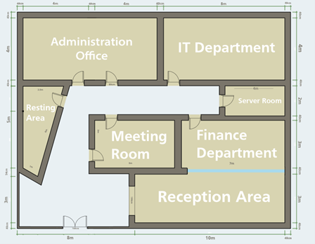
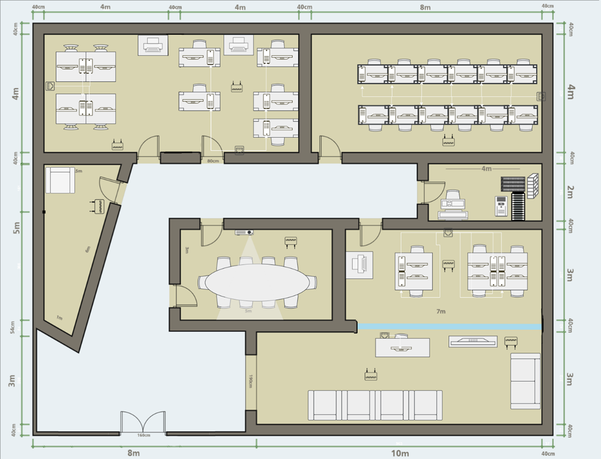
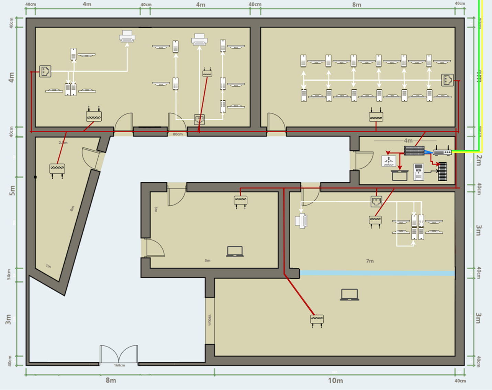
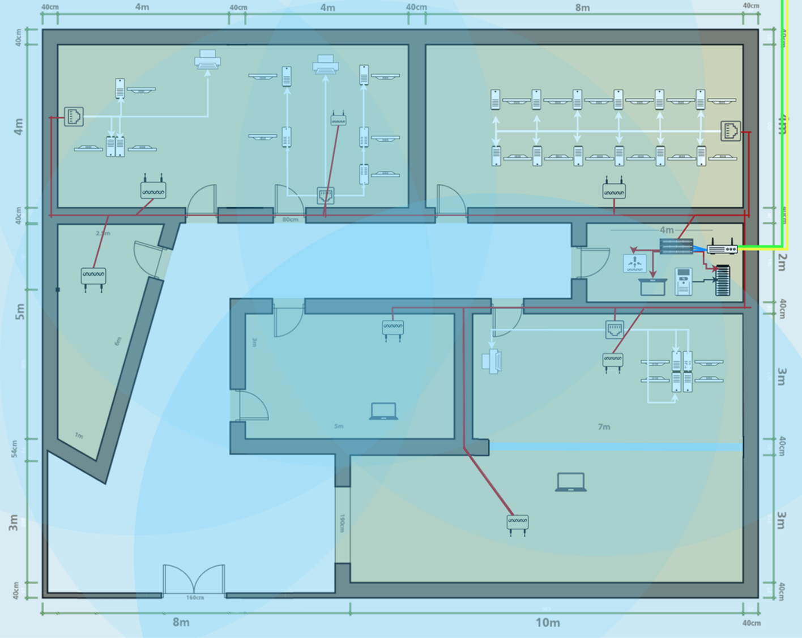
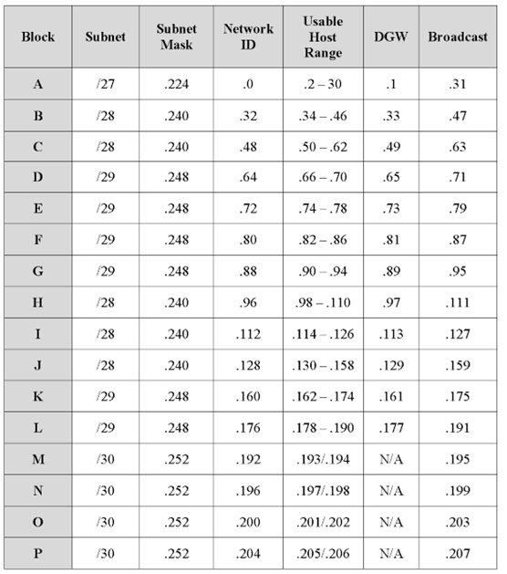
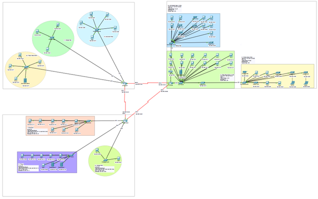
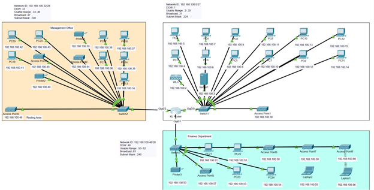
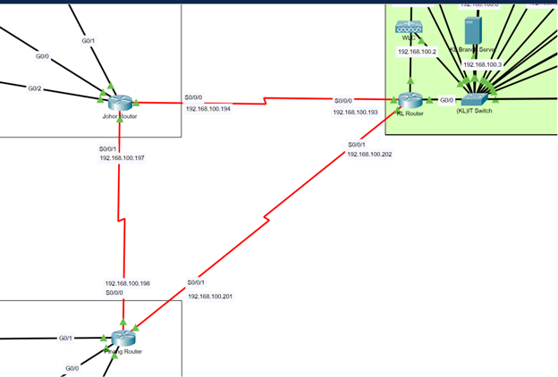

# SkyNetix Enterprise Network Design — Cisco Packet Tracer Project

## Overview

This repository is a cleaned portfolio version of an Introduction to Networking academic group project. The project designs a multi-branch enterprise network for SkyNetix Sdn. Bhd. using Cisco Packet Tracer. The full group topology includes multiple branches connected through a WAN, with this repository documenting the Kuala Lumpur branch design as part of the overall team network solution.

## Team Contribution

- The team designed and documented the Kuala Lumpur branch network as part of the full multi-branch enterprise topology.
- The KL branch work includes assumptions, floor plan, network cabling layout, wireless coverage layout, topology justification, and addressing plan.
- The group Packet Tracer file is included to show the full multi-branch WAN context.
- The KL branch Packet Tracer file highlights the branch-specific design within the broader group topology.

## Project Features

- Cisco Packet Tracer enterprise network simulation
- Kuala Lumpur branch LAN design
- Multi-branch WAN router connectivity
- Star topology for LAN
- Point-to-point WAN router connections
- VLSM subnetting
- IP addressing plan
- Network diagrams and documentation

## Technologies Used

- Cisco Packet Tracer
- Computer Networking
- LAN/WAN Design
- VLSM
- IP Addressing
- Subnetting
- Static Routing
- Network Documentation

## Project Structure

```text
skynetix-network-design-packet-tracer/
├── README.md
├── .gitignore
├── packet-tracer/
│   ├── group-network-topology.pkt
│   └── kl-branch-topology.pkt
├── diagrams/
│   ├── kl-floor-plan-labeled.png
│   ├── kl-floor-plan-detailed.png
│   ├── kl-network-cabling-layout.png
│   ├── kl-wireless-coverage-layout.png
│   ├── vlsm-table.png
│   └── ip-addressing-table.png
├── screenshots/
│   ├── all-branches-topology.png
│   ├── kl-branch-topology.png
│   └── wan-routers-connection.png
└── documentation/
    └── skynetix-network-design-summary.pdf
```

## Packet Tracer Files

- `packet-tracer/group-network-topology.pkt` = full group network topology across branches
- `packet-tracer/kl-branch-topology.pkt` = KL branch topology

## Diagrams

### KL Floor Plan



### Detailed KL Floor Plan



### KL Network Cabling Layout



### KL Wireless Coverage Layout



### VLSM Table


### IP Addressing Table



## Packet Tracer Screenshots

### Full Multi-Branch Network Overview



### Kuala Lumpur Branch Topology



### WAN Router Connections



## Documentation

[Network Design Summary PDF](documentation/skynetix-network-design-summary.pdf)

## What We Learned

- designing LAN/WAN topologies
- applying VLSM and subnetting
- planning IP addressing
- using Cisco Packet Tracer for simulation
- documenting network diagrams and topology decisions
- understanding how branch routers connect in enterprise networks

## Future Improvements

- add router configuration screenshots
- add successful ping/connectivity test screenshots
- include VLAN segmentation
- include dynamic routing such as OSPF
- add security policies and ACLs
- improve redundancy between branches

## Privacy Notes

This repository is a cleaned portfolio version of an academic group project. Private academic details such as TP numbers, lecturer names, full group member lists, signatures, and raw submission pages are excluded.
